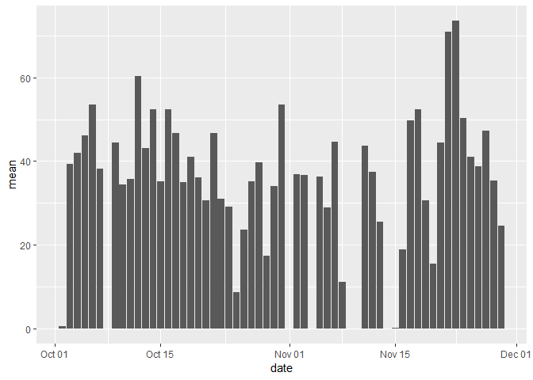
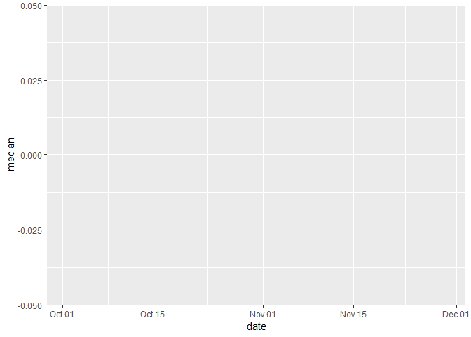
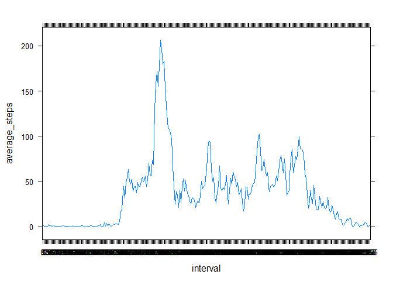
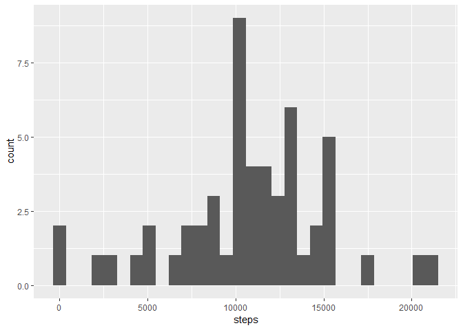
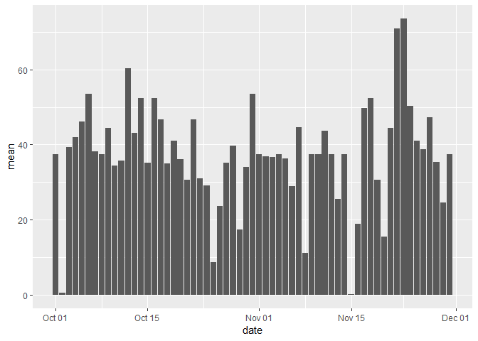
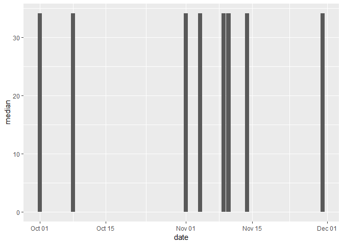
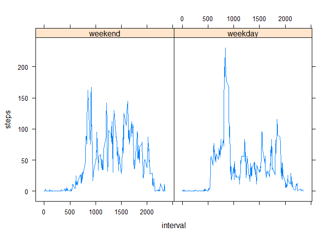

# Loading and preprocessing the data

```r
activity_data <- read.csv(unzip("activity.zip"))
activity_data$date <- as.Date(activity_data$date)
```


# What is mean total number of steps taken per day?


## Histogram of the total number of steps taken each day

```r
library(data.table)
library(ggplot2)
activity_DT <- data.table(activity_data)
activity_per_day <- activity_DT[, sum(steps), by = date]
names(activity_per_day)[2] <- "steps"
ggplot(activity_per_day, aes(x=steps)) + geom_histogram()
```

```
## `stat_bin()` using `bins = 30`. Pick better value with `binwidth`.
```

<!-- -->

## Calculating and reporting the mean and median total number of steps taken per day

```r
mean_activity_per_day <- activity_DT[, mean(steps, na.rm = TRUE), by = date]
names(mean_activity_per_day)[2] <- "mean"
ggplot(data=mean_activity_per_day, aes(x=date, y=mean)) + geom_bar(stat="identity")
```

<!-- -->

```r
median_activity_per_day <- activity_DT[, median(steps, na.rm = TRUE), by = date]
names(median_activity_per_day)[2] <- "median"
ggplot(data=median_activity_per_day, aes(x=date, y=median)) + geom_bar(stat="identity")
```

<!-- -->

# What is the average daily activity pattern?

## Time series plot (i.e. type = "l") of the 5-minute interval (x-axis) and the average number of steps taken, averaged across all days (y-axis)

```r
library(lattice)
activity_DT$interval <- as.factor(activity_DT$interval)
average_per_interval <- activity_DT[, mean(steps, na.rm = TRUE), by = interval]
names(average_per_interval)[2] <- "average_steps"
xyplot(average_steps~interval, data = average_per_interval, type = "l")
```

<!-- -->

## Which 5-minute interval, on average across all the days in the dataset, contains the maximum number of steps?

```r
max_interval <- average_per_interval[ (average_per_interval$average_steps == max(average_steps)), "interval"]
print(max_interval)
```

```
##    interval
## 1:      835
```


# Imputing missing values

## Total number of missing values in the dataset (i.e. the total number of rows with NAs)

```r
na_count <- sum(is.na(activity_data$steps))
print(na_count)
```

```
## [1] 2304
```

## Strategy for filling in all of the missing values in the dataset (average per interval)


```r
activity_data_with_average <- merge(x=activity_data, y=average_per_interval, by="interval")

for(i in 1:nrow(activity_data_with_average)){
    if(is.na(activity_data_with_average[i, "steps"])) activity_data_with_average[i, "steps"] <- activity_data_with_average[i, "average_steps"]
}
```

## Creating a new dataset that is equal to the original dataset but with the missing data filled in


```r
data_without_nas <- activity_data_with_average[, c("steps", "date", "interval")]
data_without_nas <- data_without_nas[order(data_without_nas$date),]
```

## Histogram of the total number of steps taken each day


```r
activity_DT_without_nas <- data.table(data_without_nas)
activity_per_day_without_nas <- activity_DT_without_nas[, sum(steps), by = date]
names(activity_per_day)[2] <- "steps"
ggplot(activity_per_day, aes(x=steps)) + geom_histogram()
```

```
## `stat_bin()` using `bins = 30`. Pick better value with `binwidth`.
```

<!-- -->

## Calculating and reporting the mean and median total number of steps taken per day

```r
mean_activity_per_day_without_nas <- activity_DT_without_nas[, mean(steps, na.rm = TRUE), by = date]
names(mean_activity_per_day_without_nas)[2] <- "mean"
ggplot(data=mean_activity_per_day_without_nas, aes(x=date, y=mean)) + geom_bar(stat="identity")
```

<!-- -->

```r
median_activity_per_day_without_nas <- activity_DT_without_nas[, median(steps, na.rm = TRUE), by = date]
names(median_activity_per_day_without_nas)[2] <- "median"
ggplot(data=median_activity_per_day_without_nas, aes(x=date, y=median)) + geom_bar(stat="identity")
```

<!-- -->

- The values do not differ from the first part of the assignment with the NA's
- The estimates of the total daily number of steps is not impacted by inputing missing data

# Are there differences in activity patterns between weekdays and weekends?

## New factor variable with two levels -- "weekday" and "weekend" indicating whether a given date is a weekday or weekend day


```r
weekdays <- c('Monday', 'Tuesday', 'Wednesday', 'Thursday', 'Friday')

activity_DT_without_nas$wDay <- factor((weekdays(activity_DT_without_nas$date) %in% weekdays), levels=c(FALSE, TRUE), labels=c('weekend', 'weekday'))
```


## Panel plot containing a time series plot (i.e. type = "l") of the 5-minute interval (x-axis) and the average number of steps taken, averaged across all weekday days or weekend days (y-axis)


```r
mean_interval_by_weekday_weekend <- activity_DT_without_nas[, mean(steps, na.rm = TRUE), by = c("interval", "wDay")]
names(mean_interval_by_weekday_weekend)[3] = "steps"
xyplot(steps ~ interval | wDay, data = mean_interval_by_weekday_weekend, type="l")
```

<!-- -->


